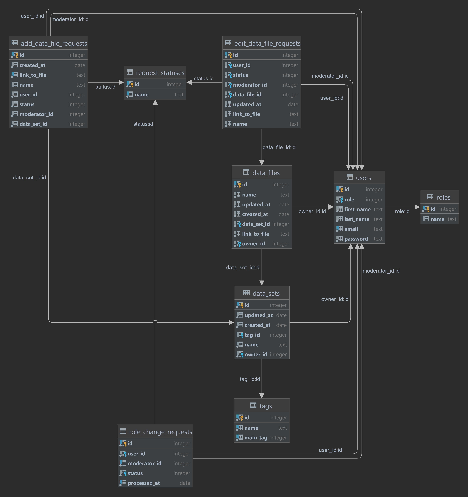

# Проєктування бази даних

В рамках проекту розробляється:
## Модель бізнес-об'єктів

@startuml
entity role #14aaf5
entity role.name
role.name --* role

entity user #14aaf5
entity first_name
entity last_name
entity email
entity password
role "1"--*"1" user
first_name --* user
last_name --* user
email --* user
password --* user

entity tag #14aaf5
entity tag.name
tag.name --* tag
tag "0,*"--*"1,1" tag

entity data_set #14aaf5
entity data_set.updated_at
entity data_set.created_at
entity data_set.name
data_set.updated_at --* data_set
data_set.created_at --* data_set
data_set "0,*"--*"1,1" tag
data_set.name --* data_set
data_set "0,*"--*"1,1" user

entity data_file #14aaf5
entity data_file.updated_at
entity data_file.created_at
entity data_file.name
entity data_file.link_to_file
data_file.name --* data_file
data_file.updated_at --* data_file
data_file.created_at --* data_file
data_file "0,*"--*"1,1" data_set
data_file.link_to_file --* data_file
data_file "0,*"--*"1,1" user

entity request_status #14aaf5
entity request_status.name
request_status.name --* request_status

entity role_change_request #14aaf5
entity processed_at
role_change_request "0,*"--*"1,1" user
role_change_request "0,*"--*"1,1" request_status
processed_at --* role_change_request

entity add_data_file_request #14aaf5
entity add_data_file_request.created_at
entity add_data_file_request.link_to_file
entity add_data_file_request.name
add_data_file_request.created_at --* add_data_file_request
add_data_file_request.link_to_file--* add_data_file_request
add_data_file_request.name--* add_data_file_request
add_data_file_request "0,*"--*"1,1" user
add_data_file_request "0,*"--*"1,1" request_status
add_data_file_request "0,*"--*"1,1" data_set

entity edit_data_file_request #14aaf5
entity edit_data_file_request.updated_at
entity edit_data_file_request.link_to_file
entity edit_data_file_request.name
edit_data_file_request.updated_at --* edit_data_file_request
edit_data_file_request.link_to_file --* edit_data_file_request
edit_data_file_request.name --* edit_data_file_request
edit_data_file_request "0,*"--*"1,1" user
edit_data_file_request "0,*"--*"1,1" request_status
edit_data_file_request "0,*"--*"1,1" data_file
@enduml

## ER-модель

@startuml
entity role #14aaf5 {
name : text
}

entity user #14aaf5 {
first_name : text
last_name : text
email : text
password : text
}
role "1"--*"1" user

entity tag #14aaf5 {
name : text
}
tag "0,*"--*"1,1" tag

entity data_set #14aaf5 {
updated_at : date
created_at : date
name : text
}
data_set "0,*"--*"1,1" tag
data_set "0,*"--*"1,1" user

entity data_file #14aaf5 {
updated_at : date
created_at : date
name : text
link_to_file : text
}
data_file "0,*"--*"1,1" data_set
data_file "0,*"--*"1,1" user

entity request_status #14aaf5 {
name : text
}

entity role_change_request #14aaf5 {
processed_at : date
}
role_change_request "0,*"--*"1,1" user
role_change_request "0,*"--*"1,1" request_status

entity add_data_file_request #14aaf5 {
created_at : date
link_to_file : text
name : text
}
add_data_file_request "0,*"--*"1,1" user
add_data_file_request "0,*"--*"1,1" request_status
add_data_file_request "0,*"--*"1,1" data_set

entity edit_data_file_request #14aaf5 {
updated_at : date
link_to_file : text
name : text
}
edit_data_file_request "0,*"--*"1,1" user
edit_data_file_request "0,*"--*"1,1" request_status
edit_data_file_request "0,*"--*"1,1" data_file
@enduml

## Реляційна схема

