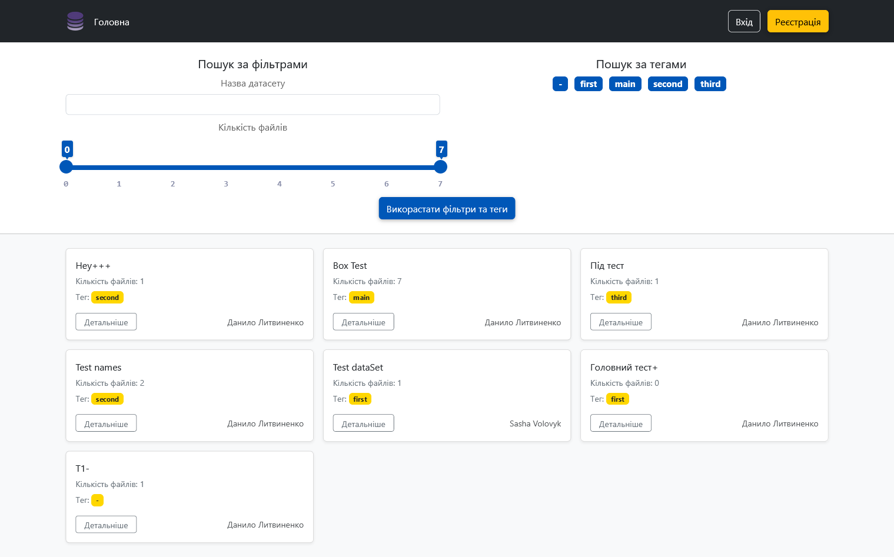
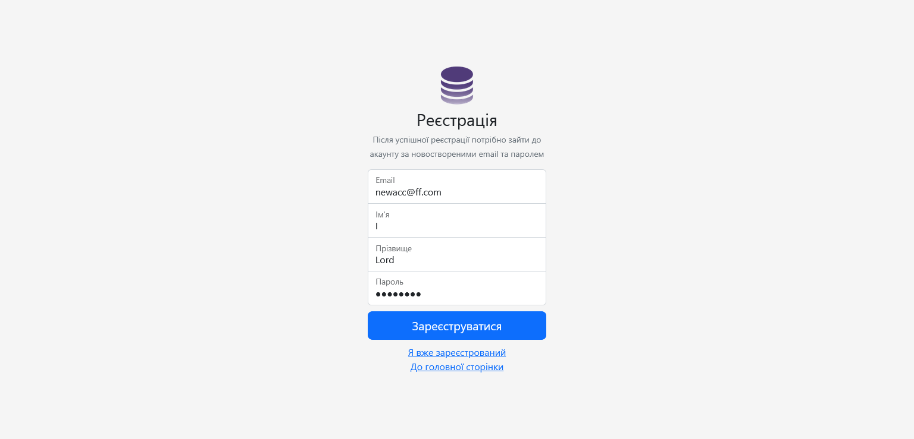
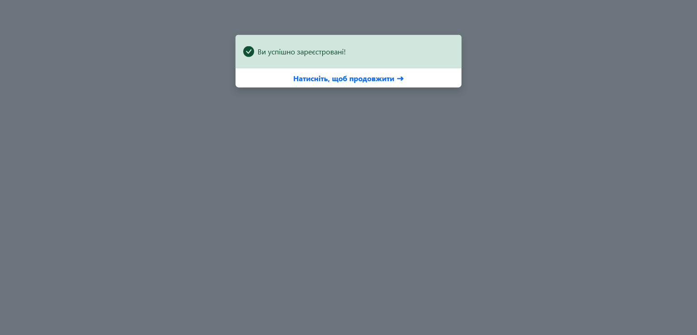
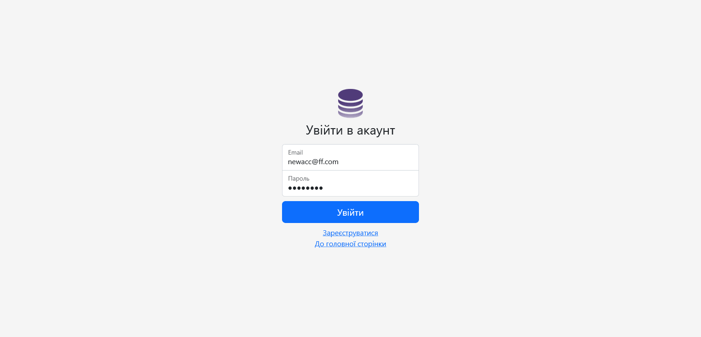
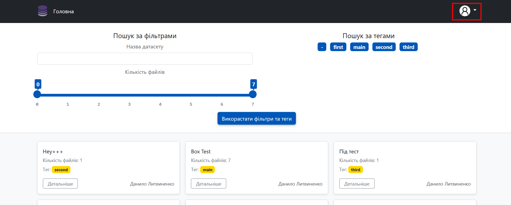
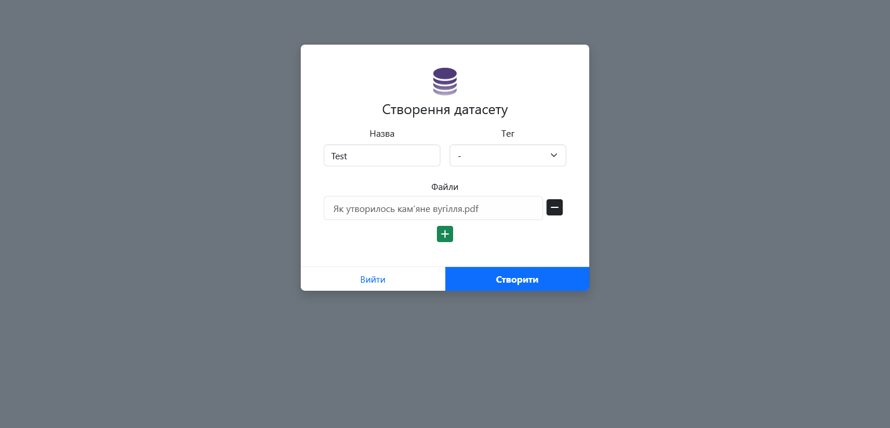
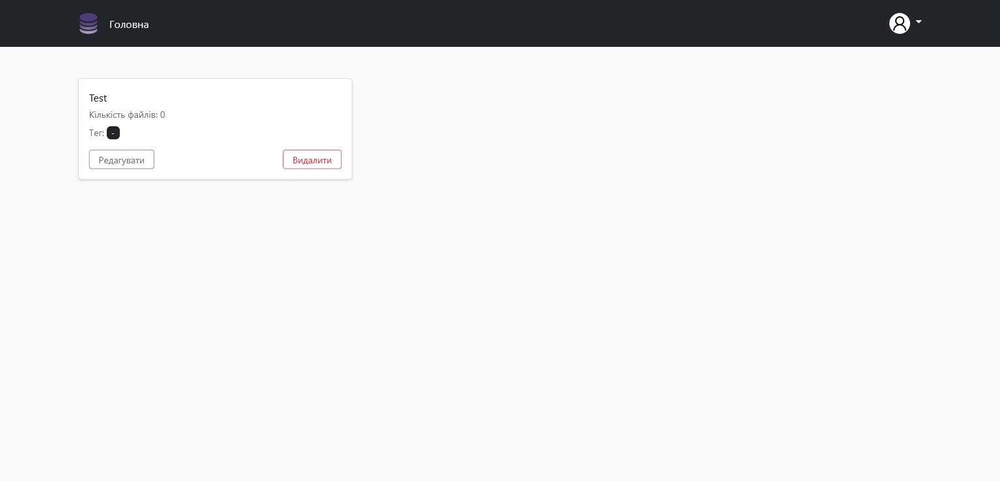
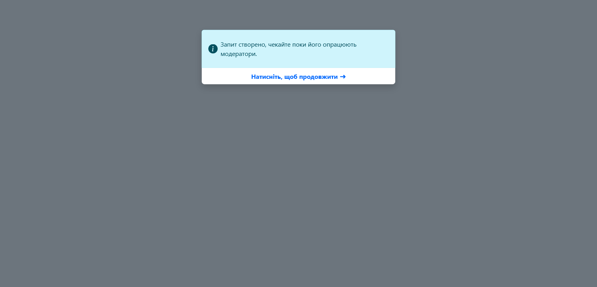
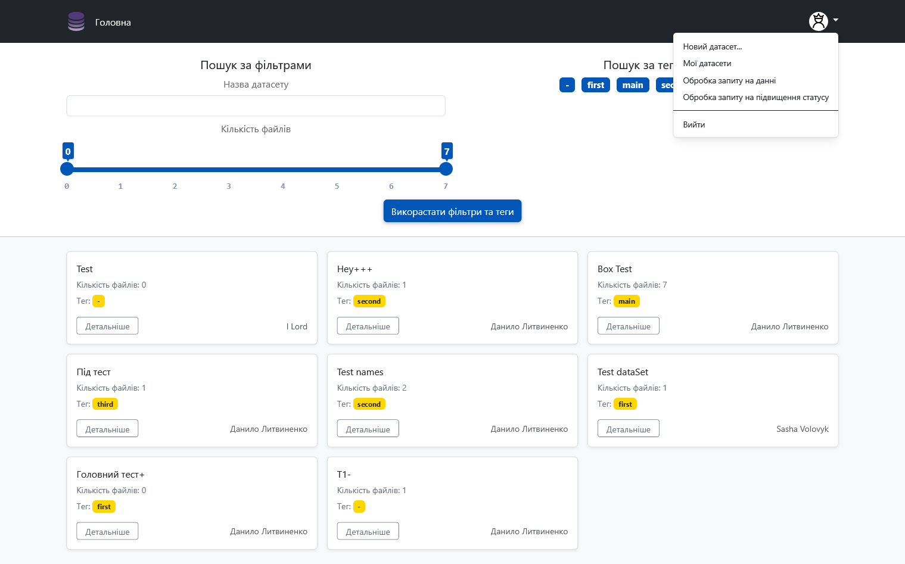

# Тестування працездатності системи
## Головна

## Реєстрація

## Вхід

## Новий датасет

## Мої датасети

## Перейти до модератора

## Функції модератора

Для перевірки функцій модератора, перейдіть за [посиланням на сайт](https://fastroof-team-project-rest.herokuapp.com/) та зайдіть під модератором:
- login: admin@test.ua
- password: 12345678

